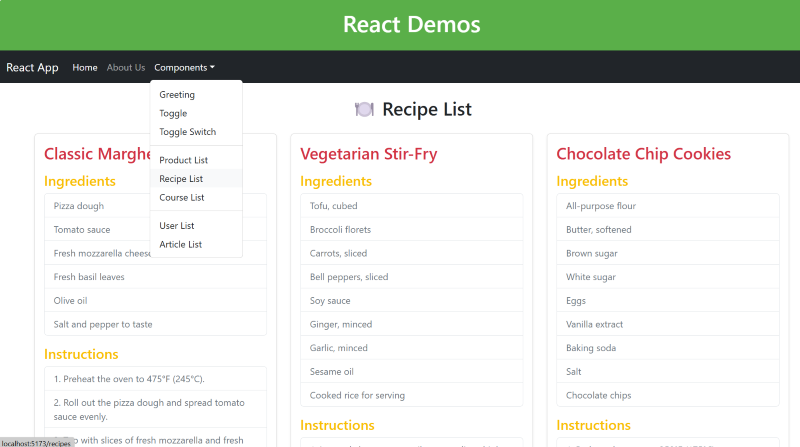

## **Assignment 10**

### Navigation Bar (using Bootstrap)
- Create a navigation bar with link to various components as shown in the image below

- Use BrowserRouter, Routes, Route and Link Components

- Use Bootstrap Navbar and link to Bootstrap CSS and Bootstrap JS
